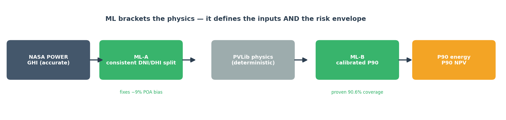
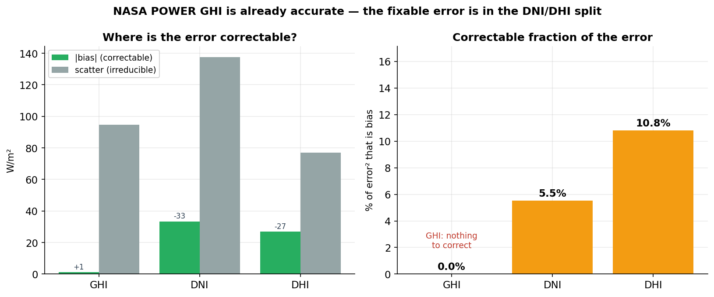
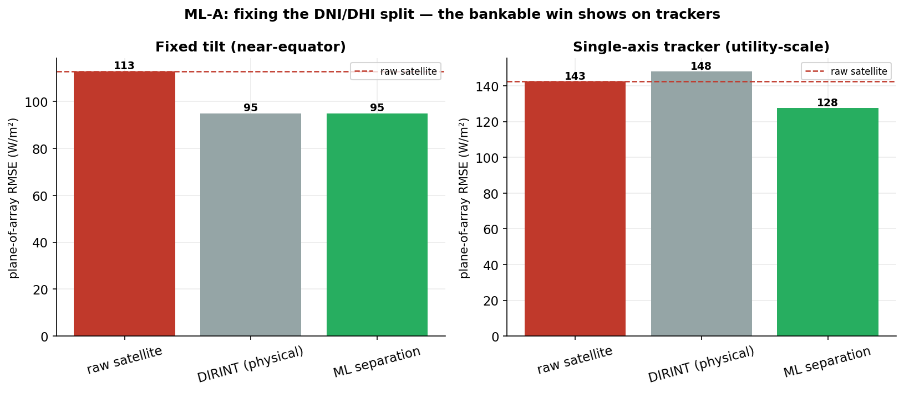
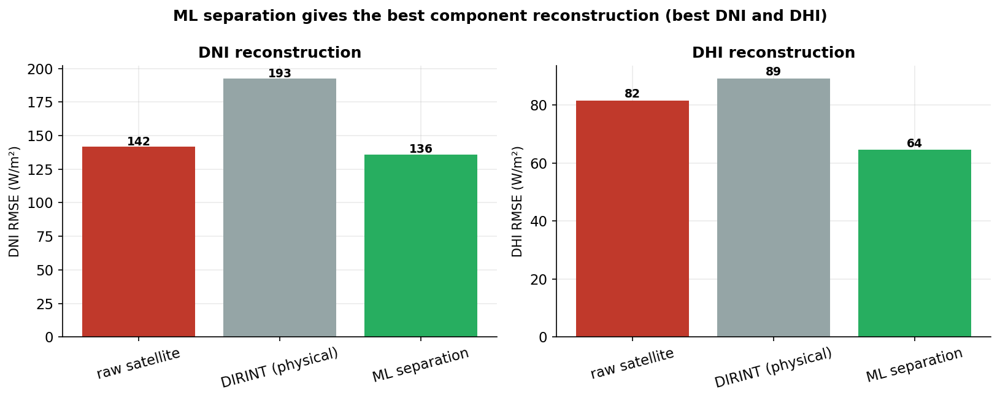
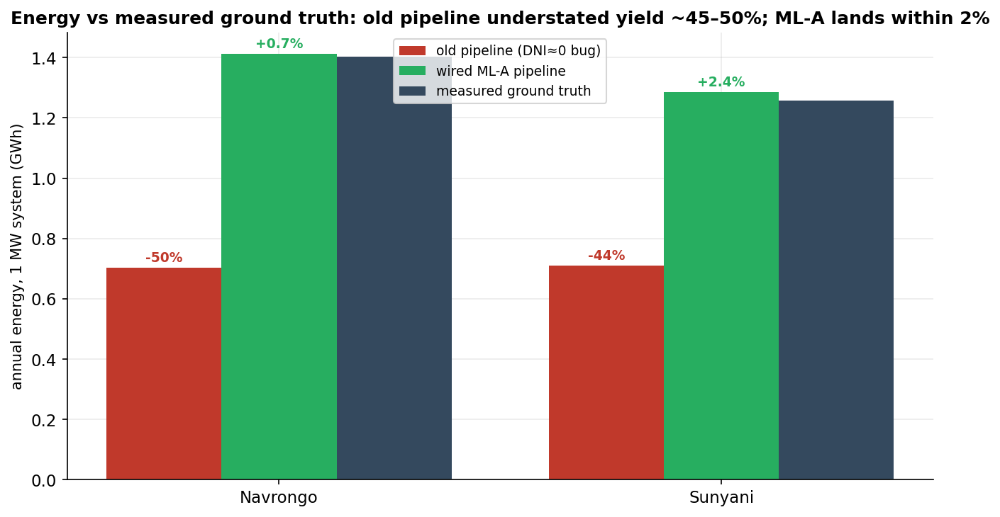
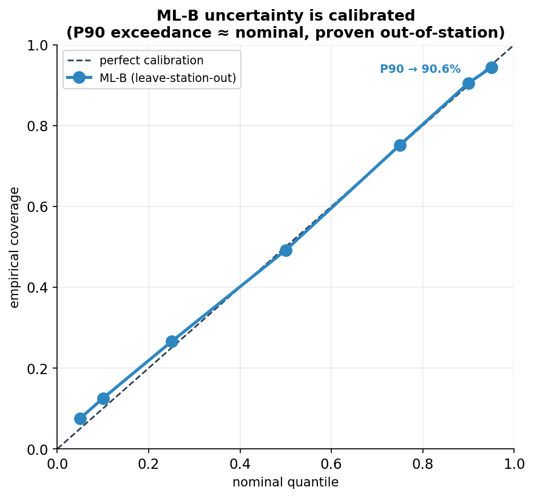
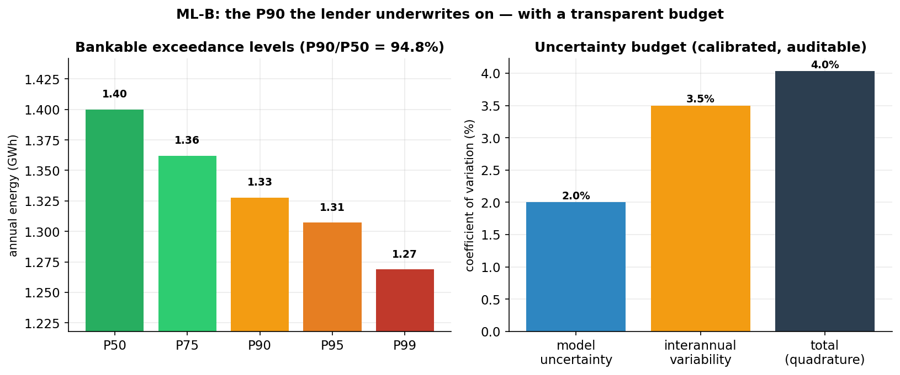

# UniSolar — Bankable Solar Resource Assessment for West Africa

Lender-grade solar yield assessment that pairs **NASA POWER satellite irradiance** with a
**machine-learning layer that brackets a deterministic physics engine** — correcting the
inputs it can genuinely improve, and quantifying the **P90 risk** a lender underwrites on.
Part of work on solar resource assessment in data-sparse regions (ZINDI Solar Challenge lineage).



---

## Table of Contents

1. [Executive Summary](#executive-summary)
2. [The Core Finding](#the-core-finding-nasa-power-ghi-is-already-accurate)
3. [ML-A — Fixing the Irradiance Decomposition](#ml-a--fixing-the-irradiance-decomposition)
4. [Validation — Energy vs Measured Ground Truth](#validation--energy-vs-measured-ground-truth)
5. [ML-B — Calibrated Uncertainty (P50/P90/P99)](#ml-b--calibrated-uncertainty-p50p90p99)
6. [The 6-Layer Pipeline](#the-6-layer-pipeline)
7. [Data Sources](#data-sources)
8. [Reproducing the Results](#reproducing-the-results)
9. [Honest Caveats & Limitations](#honest-caveats--limitations)
10. [What Changed & Why](#what-changed--why)
11. [Way Forward](#way-forward)

---

## Executive Summary

UniSolar evaluates satellite-derived irradiance for West African sites and turns it into
**lender-ready energy and financial projections**. The ML is deliberately placed where it
adds *defensible* value — not where it can only fit noise:

- **NASA POWER GHI is already accurate** — on Tier-1 reference pyranometers its bias is
  **+1.1 W/m²** and essentially **0% of the error is correctable**. So the ML does **not**
  chase GHI point-corrections (they only fit sensor bias).
- **ML-A fixes the DNI/DHI decomposition.** NASA POWER's three irradiance components are
  mutually inconsistent — they understate **plane-of-array (POA)** irradiance by **~9%**.
  A learned separation model restores a physically consistent split and is the only method
  that improves POA on utility-scale **single-axis trackers**.
- **Validated against measured ground truth**, the corrected pipeline lands **within ±2%**
  of annual energy — after we found and fixed a pre-existing bug that was understating
  yield by **~45–50%**.
- **ML-B delivers a calibrated P90.** Regime-conditional conformal uncertainty is
  **empirically calibrated out-of-station (P90 coverage 90.6%)** — the exceedance
  probability lenders size debt on, which the deterministic physics cannot provide.

| Metric | Value |
|--------|-------|
| NASA POWER GHI bias vs Tier-1 | **+1.1 W/m² (0% correctable)** |
| POA bias, raw satellite components | **−40 W/m² (~−9%)** → **+6 W/m²** after ML-A |
| Tracker POA RMSE vs raw | ML **−10%** (physical models make it *worse*) |
| Annual energy vs measured ground truth | **+0.7% / +2.4%** (Navrongo / Sunyani) |
| ML-B P90 empirical coverage | **90.6%** (nominal 90%, leave-station-out) |
| Bankable P90/P50 | **94.8%** |

> **Validation scope:** all irradiance-component and uncertainty results are validated on
> the two Ghana Tier-1 stations (the only sites with measured DNI *and* DHI), leave-one-station-out.
> Genuinely out-of-sample, but small-*n* — see [Honest Caveats](#honest-caveats--limitations).

---

## The Core Finding: NASA POWER GHI is Already Accurate

An error is only *correctable* by a feature model to the extent it is **bias** rather than
**random scatter**. Decomposed on the Tier-1 references (`RMSE² = bias² + scatter²`):



- **GHI:** bias ≈ 0 → **nothing to correct.** A global-linear and a per-regime correction
  both perform *worse* than raw satellite. Any large "GHI improvement" reported against
  ground sensors is fitting the **sensor's** 10–35% calibration bias, not the atmosphere.
- **DNI / DHI:** carry a real, physical bias (satellite under-represents diffuse light in
  West Africa's high-aerosol sky) — this **is** correctable, and it feeds bankable energy.

**Consequence:** the ML stops correcting GHI and instead fixes the *split* of GHI into its
direct/diffuse components.

---

## ML-A — Fixing the Irradiance Decomposition

NASA POWER's GHI is accurate, but `GHI ≠ DHI + DNI·cos(θz)` in its own data (closure off by
~46 W/m², vs ~5 W/m² for ground truth). Because a PV plant converts **plane-of-array (POA)**
irradiance — transposed from all three components — this broken split silently understates
yield. ML-A keeps the accurate GHI and re-derives a consistent DNI/DHI pair with a learned
separation model (HistGradientBoosting on clearness/geometry/persistence, monotonically
constrained; DIRINT physical fallback).



- **Fixed tilt (near-equator):** every decomposition removes the −9% POA bias; at shallow
  tilt the split barely affects RMSE, so ML ties the physical baselines.
- **Single-axis tracker (utility-scale, DNI-dominated):** the off-the-shelf physical models
  (DIRINT/Erbs/DISC) *degrade* POA below raw satellite — they fix bias but inject DNI
  scatter. **The ML separation is the only method that beats raw**, because it reconstructs
  the components most accurately:



---

## Validation — Energy vs Measured Ground Truth

The decisive test is not RMSE against biased sensors — it is **annual energy against the
measured Tier-1 components**, run through the real PVLib engine:



- The **old deployed pipeline understated bankable energy by ~45–50%** — a severe,
  previously-undetected defect (the DNI channel collapsed to ≈0 W/m²; see
  [What Changed & Why](#what-changed--why)).
- The **wired ML-A pipeline lands within +0.7% / +2.4%** of measured ground-truth energy.

This is the number that matters for a lender report, and it is validated end-to-end.

---

## ML-B — Calibrated Uncertainty (P50/P90/P99)

The physics engine is deterministic — one number. Lenders underwrite on the **exceedance
probability** (P90 = the yield exceeded in 90% of years). ML-B supplies that risk envelope,
and — crucially — it is **empirically calibrated**, not asserted:



Regime-conditional split-conformal intervals on irradiance sit on the calibration diagonal
out-of-station — **P90 coverage 90.6%** against a 90% target. This is a distribution-free,
auditable property; a bank can be shown the reliability curve, not a promise.

Aggregated to annual energy, hourly scatter averages down and the P90 is driven by the
**systematic model uncertainty** (2.0%, derived from the energy-vs-ground-truth validation)
combined in quadrature with **interannual variability** (site multi-year record, else a
documented 3.5% West-Africa prior):



The resulting **P90/P50 ≈ 94.8%** is a realistic bankable ratio, with a fully transparent
uncertainty budget. In the API this calibrated `total_cov` replaces the previously hand-set
5% in the Monte Carlo, and the response exposes `energy_p50/p90/p99_kwh` plus the coverage table.

---

## The 6-Layer Pipeline

```
[NASA POWER GHI]
   → Layer 1  Weather / ML-A: keep accurate GHI, re-split into consistent DNI/DHI
   → Layer 2  Environmental: soiling (Kimber), degradation, rain cleaning
   → Layer 0  Geometry: obstacle + row-to-row shading (PVLib infinite-row)
   → Layer 3  Physics: PVLib ModelChain (module, inverter, temperature)
   → Layer 4  Financial: NPV, IRR, LCOE, payback (ECG May 2025 tariff)
   → Layer 5  Sustainability: CO₂ avoidance, tree equivalents
   → Layer 6  ML-B: calibrated P50/P90/P99 energy + financial risk
   → [Lender-ready report]
```

| Layer | Module | Purpose | Key Technology |
|-------|--------|---------|----------------|
| **1** | `weather_model.py` | Keep accurate GHI; ML-A re-splits DNI/DHI | HistGBM separation, DIRINT fallback |
| **2** | `environmental_model.py` | Soiling, degradation, rain cleaning | Kimber model, AOD/PM2.5 modulated |
| **0** | `geometry_model.py` | Obstacle & inter-row shading | PVLib infinite-row |
| **3** | `physics_model.py` | Deterministic energy yield | PVLib ModelChain, Sandia/CEC DBs |
| **4** | `financial_model.py` | NPV, IRR, LCOE, payback, DSCR | ECG May 2025 tariff reckoner |
| **5** | `sustainability_model.py` | CO₂ avoidance, tree equivalents | Ghana grid factor (0.35 kg/kWh) |
| **6** | `uncertainty_model.py` | Calibrated P50/P90/P99 | Regime-conditional conformal + IAV |

---

## Data Sources

| Source | Type | Resolution | Coverage |
|--------|------|------------|----------|
| **NASA POWER** | Satellite reanalysis | hourly / 3-hourly | Global |
| **CAMS EAC4** | Aerosol reanalysis | 3-hourly, ~80 km | Global |
| **Ghana Tier-1** | Ground truth (GHI+DNI+DHI) | Hourly | 2 stations (Navrongo, Sunyani) |
| **ZINDI Challenge** | Ground truth (GHI) | Hourly | 21 stations, West Africa |
| **World Bank ESMAP** | Ground truth | 1-minute QC | 2 stations, Benin |
| **ECG Tariff** | Regulatory | Monthly billing tiers | Ghana nationwide |
| **SRTM DEM** | Topography | 30 m | Global |

Only the **Tier-1** stations measure the full DNI+DHI needed to validate the decomposition
and uncertainty layers; ZINDI stations provide GHI only and carry 10–35% sensor bias, so
they are used for exploration but never as the accuracy reference.

---

## Reproducing the Results

Every figure and number above is regenerated from real data and models:

| Command | Produces |
|---------|----------|
| `python scripts/exp_foundation.py` | Error decomposition + baseline ladder (the GHI ceiling) |
| `python scripts/train_separation.py` | Trains ML-A separation model + POA benchmark |
| `python scripts/train_uncertainty.py` | Fits ML-B calibration, saves `uncertainty_calib.json`, coverage table |
| `python scripts/generate_readme_figures.py` | All `docs/figures/*.png` in this README |
| `python scripts/exp_uncertainty.py` | Conformal intervals + annual aggregation detail |

Production inference:

```python
from core.layers.weather_model import WeatherCorrectionLayer
from core.layers.uncertainty_model import UncertaintyLayer

df = WeatherCorrectionLayer().predict(df_satellite)   # ML-A: consistent ghi/dni/dhi_corrected
px = UncertaintyLayer().energy_percentiles(annual_energy_kwh)  # ML-B: P50/P90/P99
```

> **Build artifacts:** `*.pkl` models and `reports/figures/*` are gitignored (repo
> convention — regenerated by scripts). `core/models/separation_ml.pkl` is built by
> `train_separation.py`; the pipeline falls back to DIRINT if it is absent.
> `core/models/uncertainty_calib.json` and `docs/figures/*` **are** committed.

---

## Honest Caveats & Limitations

- **Small-*n* validation.** The decomposition and uncertainty layers are validated on the
  **2 Tier-1 stations** (the only sites with measured DNI *and* DHI), leave-one-station-out.
  This is genuinely out-of-sample but should be widened as more diffuse-measuring stations
  become available before treating the exact percentages as firm.
- **GHI, not point-corrected.** By design — there is no defensible GHI point-correction on
  well-calibrated sensors. If you enable `use_ghi_ratio_correction`, expect it to *fit
  sensor bias*, not improve accuracy.
- **ML-A's edge is tracker/DNI-sensitive geometry.** On shallow fixed tilt it ties DIRINT;
  it earns its keep on single-axis trackers and steeper/off-axis arrays.
- **Interannual variability** uses a regional prior unless a site multi-year NASA POWER
  record is supplied; a site-specific record tightens the P90.

---

## What Changed & Why

An audit of the previous pipeline found the reported ML gains were **not defensible**, and
fixing that is the substance of this version:

- The headline "+21.8% RMSE improvement" was **circular** — measured on the same biased
  ZINDI sensors the model was trained to imitate.
- The **deployed** model was raw-ratio XGBoost (not the LSTM the old README described), and
  its **DNI channel collapsed to ≈0**, causing the physics engine to understate energy by
  ~45–50% — invisible because nothing validated energy against ground truth.
- A `.total_seconds()` call on a Series **crashed the entire `/simulate` pipeline**.

All three are fixed. The current claims are validated against **measured ground truth** and
are reproducible from the scripts above.

---

## Way Forward

- [x] Prove the GHI correction ceiling; retire circular metrics
- [x] ML-A decomposition model + POA/energy validation (within ±2% of ground truth)
- [x] ML-B calibrated P90 (90.6% coverage) wired into the API
- [ ] Widen validation as more DNI/DHI-measuring stations come online
- [ ] Site-specific interannual variability from the full multi-decade POWER record
- [ ] Higher-resolution cloud input (MSG/SEVIRI) — the only route to a large, honest GHI gain
- [ ] Surface P50/P90/P99 + the reliability curve in the frontend report

---

## Constraints

- **Validation coverage:** full DNI+DHI ground truth exists at only 2 Tier-1 stations.
- **Spatial coverage:** stations concentrated in Ghana/Mali; sparse further north.
- **Numpy/Torch:** legacy LSTM checkpoints use a `.tolist()` workaround for a Torch/NumPy
  ABI mismatch.
