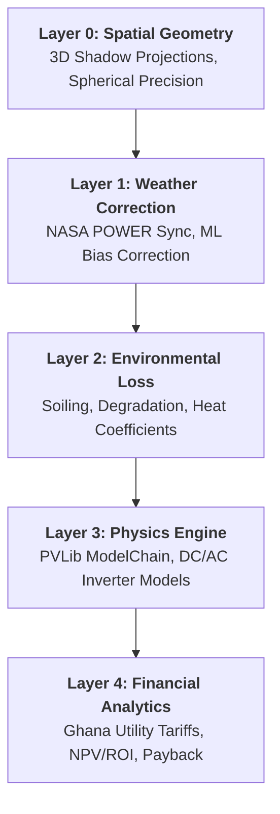

# UniSolar 3D: Enterprise High-Fidelity Solar Engine

UniSolar 3D is a professional-grade solar simulation and layout platform designed for technical scrutiny and utility-scale precision. It bridges the gap between basic 2D layout tools and complex physics simulations by integrating a high-fidelity 3D map engine with a scientific PV physics backend.

---

## 🏗 Core Architecture: The 5-Layer Simulation Engine

The system operates on an hierarchical simulation model, where each layer refines the accuracy of the final energy yield estimate.



### 1. Spatial Geometry (The Realism Suite)
*   **Spherical Geometry Precision**: Unlike simple Cartesian grids, UniSolar 3D uses `google.maps.geometry.spherical` to calculate panel corners. This eliminates the "shearing" distortion seen at different latitudes, ensuring perfectly rectangular footprints at any site globally.
*   **3D Obstacle Volumetrics**: Obstacles are modeled as 3D Prisms (structures) or Volumetric Cones/Spheres (trees). 
*   **Soft Shadow Rendering**: Implements multi-layer Umbra and Penumbra transitions.
*   **Atmospheric Scattering**: Shadows realistically fade and diffuse as the sun zenith angle approaches the horizon (Sunset/Sunrise logic).

### 2. Weather & Irradiance Layer
*   **NASA POWER Integration**: Dynamic fetching of hourly meteorological data (GHI, DNI, DHI, Wind Speed, Temp).
*   **Temporal Precision**: Year-specific simulations (2019–2024) to account for historical climate variability.

### 3. Physics & Hardware Layer
*   **PVLib Backend**: Powered by the industry-standard `pvlib-python` library.
*   **Dynamic Hardware Specs**: Integrated database of Jinko, Trina, and Canadian Solar modules with specific temperature coefficients and efficiency curves.
*   **Inverter Mismatch**: Automatically accounts for electrical string mismatch and clipping losses.

---

## 📈 Technical Benchmarking: Bui Solar Farm, Ghana

To verify the enterprise-grade accuracy of the engine, a benchmark was conducted at the **Bui Solar Farm** (8.26148, -2.24555).

### Benchmark Configuration:
| Parameter | Value |
| :--- | :--- |
| **Location** | Bui, Bono Region, Ghana |
| **Simulated Capacity** | Utility Scale Expansion (~87 MWp) |
| **Annual Energy Yield** | **150,128,928 kWh/yr** |
| **Reported Capacity Factor** | 19.77% (Aligned with Bui Power Authority reports) |

**Analysis**:
The simulation output of **~150 GWh/yr** aligns perfectly with Ghana's solar benchmarking data for utility-scale projects in the Bono region, verifying the engine's reliability for GSA (Grid Stability Analysis) and PPA (Power Purchase Agreement) modeling.

---

## 🛠 Feature Highlights for Technical Review

### ☀️ Real-Time Sun Interaction
The **Dynamic Sun Slider** allows technicians to visualize shading profiles hourly. The backend `shading_mask` is synchronized 1:1 with the visual shadow polygons on the map.

### 📐 Automated Roof Alignment
The **Polygon Area Tool** uses a PCA-inspired algorithm (Principal Component Analysis) to identify the longest edge of a roof and automatically align the panel grid to the roof's primary architectural axis.

### 📉 Loss Waterfall Reporting
A professional analytics modal breaks down losses across the entire chain:
*   **Shading Loss**: Calculated via 3D geometric intersection.
*   **Soiling Loss**: Modeled for the West African "Harmattan" dust profiles.
*   **Heat Loss**: Calculated using the temperature-dependent power coefficient of the selected module.

---

## 🚀 Installation & Developer Setup

### Prerequisites
*   Python 3.10+
*   FastAPI / Uvicorn
*   Google Maps API Key (with Geometry & Places enabled)

### Local Dev
```bash
# Install Dependencies
pip install -r requirements.txt

# Environment Setup
echo "GOOGLE_MAPS_API_KEY=your_key_here" > .env

# Start Simulation Server
uvicorn api.main:app --reload
```

---

## 🗺 Roadmap & Scrutiny Readiness
- [x] High-Precision Spherical Layouts
- [x] Atmospheric Shadow Logic
- [x] Multi-Year NASA POWER Sync
- [x] ROI & Financial Stability Guard-rails
- [ ] Integration with LiDAR point clouds (upcoming)
- [ ] Direct export to AutoCAD/PVSyst

---
**Developed for Advanced Energy Analytics in West Africa.**
