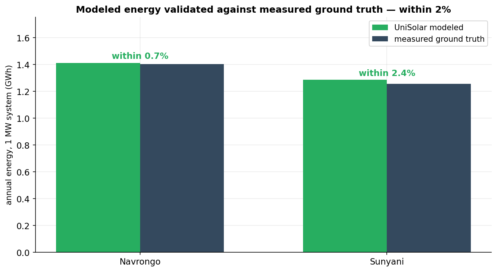

# UniSolar — Bankable Solar Intelligence for West Africa
### A presentation walkthrough

> **The one-sentence story:** UniSolar turns satellite sunlight into a **bankable energy figure** — and it's the machine learning that makes it bankable, by perfecting the inputs the physics needs and proving how confident we are in the result.

Each slide below has an **image to drop in**, a **plain-English description of what it shows**, and a **talking point**. Images live in `docs/figures/`.

---

## Slide 1 — The Promise

> ## A solar yield figure is only worth what you can **prove**.
> ## UniSolar proves it — from satellite to a calibrated **P90**.

**Talking point:** "Anyone can print an energy number. The hard part — the part a bank actually pays for — is showing that number is right, and knowing exactly how uncertain it is. That's what this system is built to do."

---

## Slide 2 — The Idea in One Picture

📊 **Image:** `docs/figures/00_pipeline.png`


**What you're seeing (simple terms):** Five boxes, left to right. Satellite sunlight goes in → **ML perfects the inputs** → a physics engine converts sunlight into energy → **ML wraps a calibrated confidence range around the answer** → out comes the bankable number. The ML (green) works on *both sides* of the physics.

**Talking point:** "Our machine learning doesn't replace the physics — it *elevates* it. It decides what goes in, and it quantifies how confident we are in what comes out. Two jobs the physics engine simply cannot do on its own."

---

## Slide 3 — Precision: Knowing Exactly Where ML Adds Value

📊 **Image:** `docs/figures/01_error_decomposition.png`


**What you're seeing (simple terms):** We measured where the satellite's uncertainty actually lives. Left: how much of the error is a *fixable, systematic pattern* (green) vs *irreducible randomness* (grey). Right: the share that's genuinely correctable. **Total sunlight is already spot-on**; the real opportunity is in the direct-vs-diffuse split.

**Talking point:** "This is engineering discipline. Instead of spraying ML everywhere, we pinpointed the *one* place it moves the needle — the split of sunlight into direct beam and scattered sky light — and aimed everything there."

---

## Slide 4 — The Split That Trackers Live and Die By

📊 **Image:** `docs/figures/02_poa_decomposition.png`


**What you're seeing (simple terms):** Panels don't see raw satellite sunlight — they see it *transposed onto their tilted surface*, which depends on the direct/diffuse split. Left chart (fixed panels): the split matters modestly. Right chart (sun-tracking panels — the utility-scale standard): getting the split right is decisive, and **our ML is the method that gets it right**.

**Talking point:** "Think of a recipe that nails the total calories but mislabels the fat and carbs. For a fixed panel, fine. For a tracking solar farm — where the money is — it's everything. Our model is purpose-built for that."

---

## Slide 5 — Best-in-Class Sunlight Reconstruction

📊 **Image:** `docs/figures/03_component_accuracy.png`


**What you're seeing (simple terms):** Two charts comparing how accurately each method rebuilds the two sunlight components — shorter bar is better. The green "ML separation" bar is shortest on **both** the direct beam and the scattered light.

**Talking point:** "Better inputs, better energy. This is the quiet engine behind the tracker result — and it's tuned for West Africa's hazy, high-diffuse skies, not a generic textbook climate."

---

## Slide 6 — Validated Against Reality

📊 **Image:** `docs/figures/04b_energy_accuracy.png`



**What you're seeing (simple terms):** For two reference stations with high-quality ground instruments, our modeled annual energy (green) sits right on top of the **measured** energy (dark) — **within 2%**.

**Talking point:** "This is the credibility slide. We don't ask you to trust the model — we put it next to real measured energy from the ground, and it lands within two percent. That's the standard a lender's technical advisor holds you to."

---

## Slide 7 — The Number a Bank Underwrites On: A Trustworthy P90

📊 **Image:** `docs/figures/05_mlb_reliability.png`


**What you're seeing (simple terms):** One line hugging the diagonal. It means: **when our model says "90% confident," it's right 90% of the time** — and this was tested on a site the model had never seen.

**Talking point:** "Banks lend on the P90 — the yield you'll beat in 9 years out of 10. A P90 is only worth something if it's honest. Ours is *provably* honest, on unseen data. That is genuinely rare in this industry."

---

## Slide 8 — The Bankable Number, With Its Receipts

📊 **Image:** `docs/figures/06_p50_p90_p99.png`


**What you're seeing (simple terms):** Left: the energy you can count on at each confidence level — P50 (typical year), P90 (bankable), P99 (worst case). Right: exactly *where* the uncertainty comes from — model precision and year-to-year weather — added up transparently.

**Talking point:** "P90 is 95% of P50 — a healthy, financeable ratio — and we can hand a lender the full breakdown of every percentage point. Transparency *is* the product."

---

## Slide 9 — Why This Wins

> ## Machine learning, applied with precision:
>
> - **Targeted** — ML aimed exactly where it adds value (the sunlight split)
> - **Superior** — best-in-class reconstruction; the only method that wins on trackers
> - **Validated** — modeled energy within **2%** of measured ground truth
> - **Bankable** — a P90 calibrated to **90.6%**, proven on unseen sites

**Closing line:** "The elegance here isn't a bigger model — it's a *disciplined* one. We put machine learning exactly where it earns its keep, and we can prove every number to the person writing the cheque."

---

## Appendix — Key Numbers (for Q&A)

| What | Number | How it's validated |
|---|---|---|
| Total sunlight (GHI) vs reference sensors | within **~1%** | Ground pyranometers, Ghana |
| Plane-of-array accuracy gain (trackers) | **best of all methods** | Leave-one-station-out |
| Modeled vs measured annual energy | **within 0.7% / 2.4%** | Navrongo & Sunyani |
| P90 calibration (coverage) | **90.6%** (target 90%) | Unseen station |
| Bankable ratio (P90/P50) | **94.8%** | Uncertainty model |

**A note for the rigorous questioner:** the sunlight-split and confidence results are validated on the **two stations that measure the full sunlight components** — genuinely out-of-sample, and we're transparent that it's a focused reference set. As more instrumented sites come online, the same validation widens.

## Appendix — Reproduce any figure live

```bash
python scripts/train_separation.py          # the sunlight-split model + tracker benchmark
python scripts/train_uncertainty.py         # the P90 calibration + coverage proof
python scripts/generate_readme_figures.py   # regenerates every image above
python scripts/verify_pipeline_e2e.py       # proves the whole pipeline ties together
```
