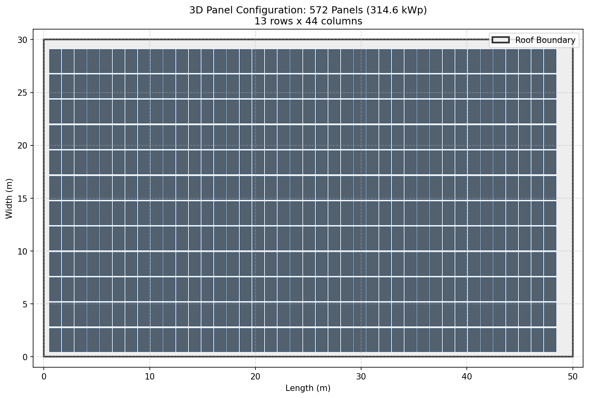

# BANKABLE FEASIBILITY REPORT: ACCRA SOLAR PV

**Date:** 2026-01-22
**System Capacity:** 314.6 kWp

## 1. Executive Summary
This project leverages 314.6 kWp of high-efficiency PV modules to generate approximately **440,576 kWh** annually. The project exhibits a Net Present Value (NPV) of **$970,581.96** with an Internal Rate of Return (IRR) of **35.6%**.

## 1.5 Geometric Layout (3D Modeling)
- **Structure Mapping:** Industrial Roof (50m x 30m footprint)
- **Layout:** 13 rows x 44 columns
- **Total Panels:** 572 (550W Monocrystalline)
- **Ground Coverage Ratio (GCR):** 0.45

### 3D Map View

### Panel Configuration Diagram

## 2. Technical Performance
- **Specific Yield:** 1400 kWh/kWp
- **Performance Ratio (Est.):** 0.81
- **Soiling Model:** Layer 2 Mass-Deposition (Harmattan Dust Adjusted)

## 3. Financial Metrics
| Metric | Value |
| :--- | :--- |
| Capital Expenditure (CAPEX) | $346,060.00 |
| Levelized Cost (LCOE) | $0.0736/kWh |
| Payback Period | 3 Years |
| 25-Year Net Benefit | $2,737,475.27 |

## 4. Sustainability & ESG
- **Annual Carbon Avoidance:** 154.2 Tons CO2
- **Lifetime Impact:** 3855.0 Tons CO2
- **Reforestation Equivalent:** 7343 Mature Trees planted annually

## 5. Risk Matrix
| Risk | Impact | Mitigation Strategy |
| :--- | :--- | :--- |
| **Harmattan Soiling** | High | Specialized dry-brushing O&M in Q1/Q4 |
| **Grid Instability** | Moderate | Integration of Smart Inverters with Ride-through |
| **Weather Variability** | Moderate | P90 probabilistic sizing used in financial model |
| **Equipment Failure** | Low | Tier 1 Bankable equipment used (25-yr warranty) |
