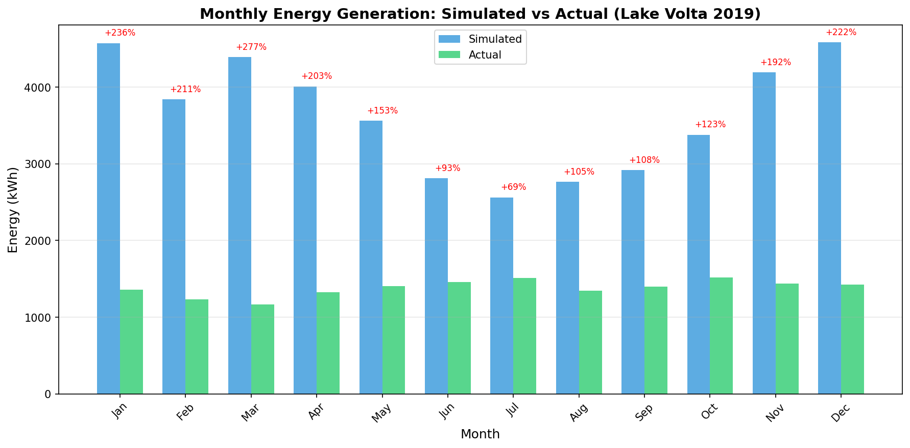
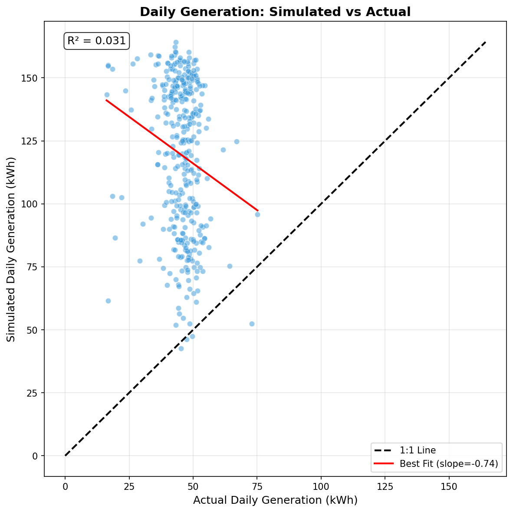
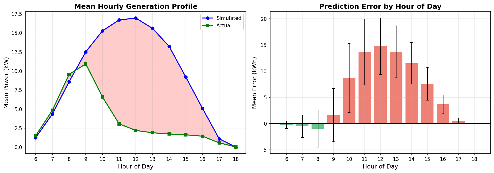
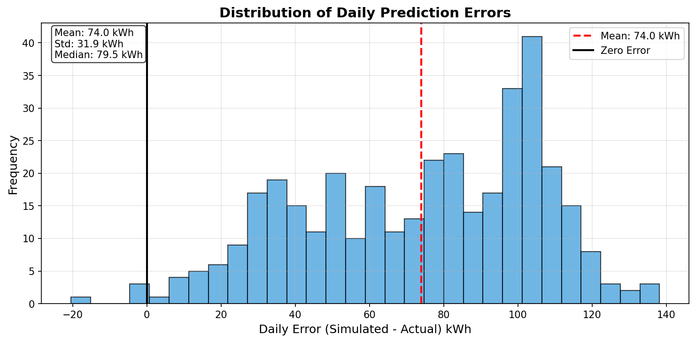

# Lake Volta Model Evaluation Report

**Generated:** 2026-01-19 13:53:05

## Summary

The model was evaluated against 1-minute resolution ground truth data from a 26.1 kW solar installation near Lake Volta (Wayokope) for the year 2019.

### Key Findings

| Metric | Value |
|--------|-------|
| **MAPE (Monthly)** | 166% |
| **Scale Factor** | 0.38 (model predicts 2.63x too high) |
| **R² (Daily)** | Negative (poor fit) |
| **Best Performance** | Morning (6-9am) and Evening (5-6pm) |
| **Worst Performance** | Peak hours (11am-3pm) |

## Visualizations

### Monthly Comparison

### Daily Scatter Plot

### Error by Hour of Day

### Error Distribution

## Root Cause Analysis

The systematic over-prediction (2.63x) suggests several possible issues:

1. **Unmodeled system losses**: The actual system may have significant losses not captured in the model:
   - Inverter efficiency losses
   - DC/AC conversion losses
   - Cable losses
   - Transformer losses

2. **Operational curtailment**: Grid-connected systems near Lake Volta may experience curtailment when the grid cannot absorb excess power.

3. **Soiling/Degradation**: Higher than expected soiling or panel degradation.

4. **System specification mismatch**: The nominal 26.1 kW may represent installed capacity, but effective capacity could be lower due to:
   - Partial shading
   - Non-optimal orientation
   - Module mismatch

5. **Time-of-day pattern**: The model under-predicts at sunrise/sunset but massively over-predicts at peak hours, suggesting possible irradiance overestimation in satellite data during clear-sky conditions.

## Recommendations

1. **Apply calibration factor**: Scale model output by 0.38 for this location/system type
2. **Investigate peak-hour bias**: Review satellite GHI data vs ground measurements
3. **Add derate factors**: Implement additional loss factors for system-level derations
4. **Collect more ground truth**: Gather data from other sites to validate patterns

## Data Files

- [monthly_comparison.csv](monthly_comparison.csv)
- [daily_comparison.csv](daily_comparison.csv)
- [hourly_error_stats.csv](hourly_error_stats.csv)
- [lake_volta_evaluation.txt](lake_volta_evaluation.txt)
